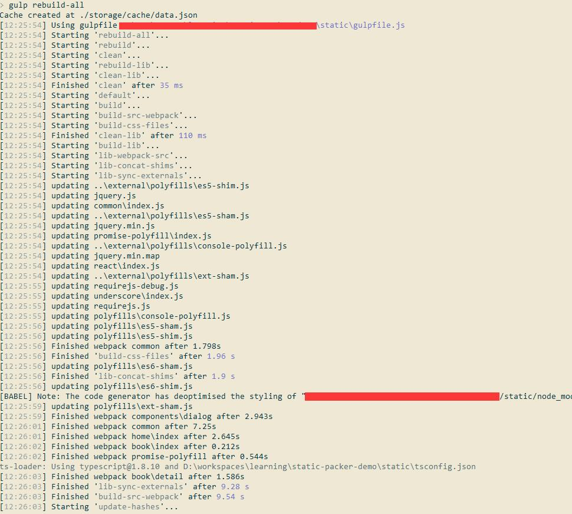
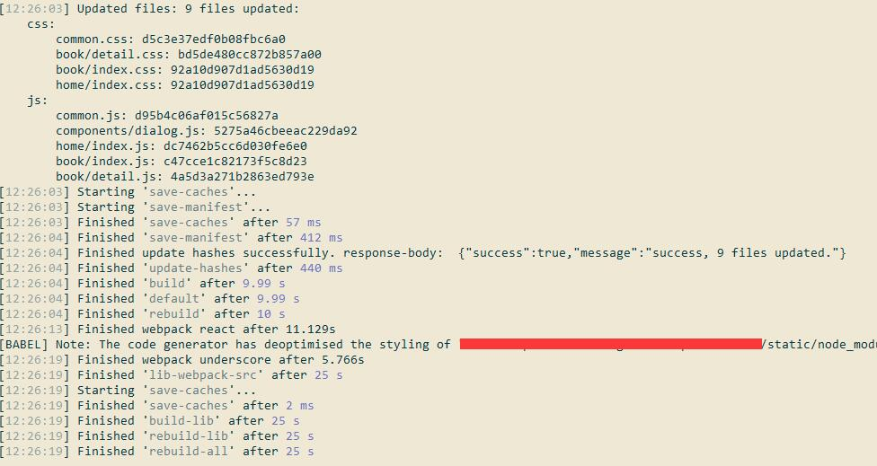
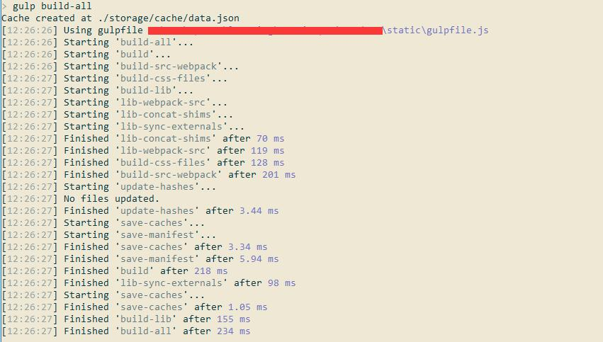

关于此项目 
==========
此项目是为了演示/测试/探索 PHP + NodeJs 的协作之道。

目标：
======

1. 一切重复的事情尽量自动化
2. 面向多页面，而非SPA
3. 前后端分离
    1. 模版中尽量精简引用的内容
    2. js中复杂的依赖关系不要在模版中暴露
4. 支持ES2015, React, TypeScript
5. 支持自动刷新版本号 -- 使用md5版本号
6. 支持非覆盖式部署
7. 构建时间要短，增量式构建 -- 增量构建时间控制在3s以内
8. 冷热分离 -- 不经常变动的代码/公共代码/库代码与经常修改的页面逻辑/业务逻辑代码独立开来
9. 首屏优化
10. 支持以AMD方式异步加载后续代码和资源

效果：
====

全量构建时间：25秒 ===> 增量构建时间: 0.2秒

全量构建:
-------

增量构建：
--------

安装与初始化:
=======

在linux系统下可以直接执行`./install.sh`即可。也可以手工执行，其中主要工作如下：

1. 初始化动态工程, 安装composer包： `cd dynamic && composer install`
2. 配置动态工程的环境变量 -- 将`dynamic/.env.example`拷贝到`dynamic/.env`并根据需要修改其中的配置
3. 初始化静态工程： `cd static && npm install -g gulp gulp-cli typescript && npm install && npm link typescript`
4. 构建应用程序的静态工程： `cd static && gulp `
5. 构建lib的静态工程：`cd static && gulp build-lib`

关于静态内容：
===========

src目录：
--------
所有`src`目录下带有`index.js`或`index.css`的目录都视作一个模块，而对应地进行构建并发布到`public/dist`目录下，如：

`src/home/index.js`  ==> `public/dist/home_xxxx.js`        
`src/home/index.css` ==> `public/dist/home_xxxx.css`
`src/home/book/detail/index.js`  ==> `public/dist/book/detail_xxxx.js`        
`src/home/book/detail/index.css` ==> `public/dist/book/detail_xxxx.css`

构建原则是将所有的样式合并成一个css文件，将所有的脚本合并成一个js文件。

注意：`index`会被自动去掉。如果文件内容有更新，则会自动刷新版本号。

public/lib目录：（冷数据）
-------------------------
`public/lib`目录下是所有直接引用的库的文件，不会被构建。如果有更新，请直接更新文件内容，并刷新`?v123`样式的版本号

TODOs
=====
- 将可以复用的部分抽象出一个独立的库
- 处理scss, less等
- 小图片自动合并到css中
- 大图片通过URL的方式引用
- 大图片自动压缩

参考：
=====

1. webpack
2. fis3

FAQ
=====

1. 通过`import something 'app/something'`的方式导入一个模块的时候，为什么有的时候点进去发现文件跟实际的文件不一样？
--------------
这个是IDE的缓存机制搞的鬼，同步一下/刷新下缓存（如WebStorm里面是叫"Synchronize xxxx"）就好了。
